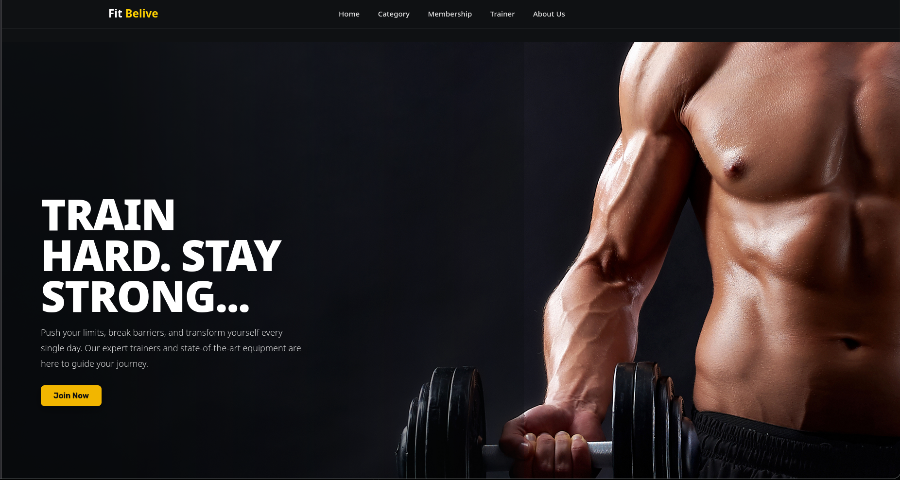
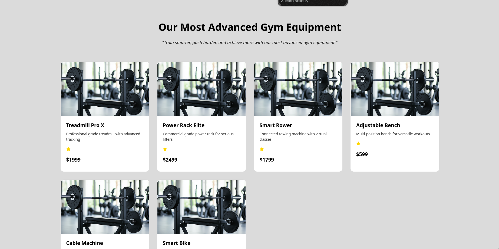

# Fitness WebApp

A modern fitness web application built using **React** and **Vite**.
It showcases gym equipment, trainers, memberships, and contact options in a responsive, minimal, and user-friendly design.

---

## Features

* Fast and lightweight using **Vite**
* Responsive and modern UI
* Gym equipment showcase with details, ratings, and prices
* Trainer and membership sections
* Contact form integration
* Modular and reusable React components

---

## Tech Stack

| Category        | Technologies            |
| --------------- | ----------------------- |
| Frontend        | React, Vite             |
| Styling         | CSS3, Flexbox, Grid     |
| Icons           | React Icons             |
| Form Handling   | EmailJS / Custom Mailer |
| Build Tool      | Vite                    |

---

## Folder Structure

```
fitnessApp/
├── public/
├── src/
│   ├── assets/          # Images and static files
│   ├── components/      # Reusable components
│   │   ├── equipment/
│   │   ├── hero/
│   │   ├── footer/
│   │   ├── navbar/
│   │   ├── trainers/
│   │   └── membership/
│   ├── pages/           # Page-level components
│   ├── App.jsx
│   ├── App.css
│   ├── index.css
│   └── main.jsx
├── package.json
├── vite.config.js
└── README.md
```

---

## Setup and Installation

1. Clone this repository:

   ```bash
   git clone https://github.com/prieyan/fitnessApp.git
   ```

2. Navigate into the project folder:

   ```bash
   cd fitnessApp
   ```

3. Install dependencies:

   ```bash
   npm install
   ```

4. Start the development server:

   ```bash
   npm run dev
   ```

5. Open your browser and visit:

   ```
   http://localhost:5173
   ```

---

## Screenshots

| Page              | Screenshot                               |
| ----------------- | ---------------------------------------- |
| Home Page         |         |
| Equipment Section |    |
| Trainers          |      |
| Membership        |  |

---

## License

This project is open source and available under the [MIT License](LICENSE).
